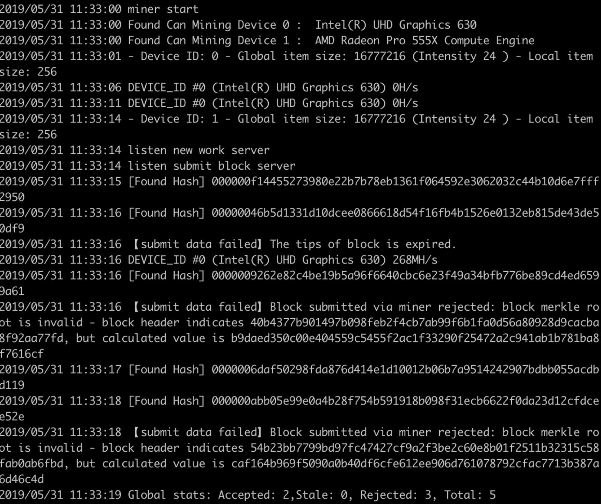
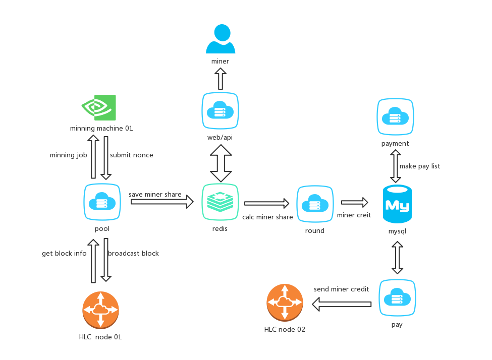

# <font color=Chocolate size=6>Miner and mining pool manual</font>

# 1.Miner

### Enviroment
- Windows 10
  
  - install opencl sdk ,recommend cuda v10.1 see [here](https://developer.nvidia.com/cuda-downloads) 
  
- Ubuntu 19 

   - need display card
    
```bash
$ sudo apt-get install beignet-dev nvidia-cuda-dev nvidia-cuda-toolkit 
```        
 
    
### Run

- Download the release [here](https://github.com/jamesvan2019/Nox-DAG-test/releases)

- Unzip the file

- Run with config file

    - rename halalchainminer.conf.example halalchainminer.conf

    - modify the config params
   
```bash
# run
$ ./hlc-miner
```
   
- Run with solo command line
    
```bash
#run 
$ ./hlc-miner -s 127.0.0.1:1234 -u test -P test --symbol HLC --notls -i 24 -W 256 --mineraddress RmN4SADy42FKmN8ARKieX9iHh9icptdgYNn 
```
- Run with pool command line

```bash
#run 
$ ./hlc-miner -o stratum+tcp://127.0.0.1:3177 -m RmN4SADy42FKmN8ARKieX9iHh9icptdgYNn --symbol HLC --notls -i 24 -W 256
``` 

### Param Description 
          
- `--dag` the node is dag node
- `-s` the node rpc listen address
- `-u` the node rpc username
- `-P` the node rpc password
- `--symbol` now just `HLC` is supported
- `--i` Intensities (the work size is 2^intensity) up to device
- `--W` The explicitly declared sizes of the work to do up to device (overrides intensity)
- `--mineraddress` the miner address
- `-o` the pool address
- `-m` the pool user account address

        


# 2.Mining pool

## pool structure diagram



the pool system contain 6 precedures:

1. pool procedure, to accept miner connect and find blocks

2. round procedure, to calculate miners share and credit

3. payment procedure, to make pay list for pay

4. pay procedure, to send coin to miner

5. admin procedure, to manage pay list

6. api procedure， to serve json data for pool index page


## system Requirements

os: linux （e.g. ubunutu 16.04>,centos 6>）

node.js enviroment (version >= 10)

redis / mysql / nginx , recommend installing from docker

hlc node (at least 1 node referring to https://github.com/HalalChain/Nox-DAG-test/blob/master/README.md)


## install

### 1. download pool code

https://github.com/HalalChain/hlc-pool/archive/master.zip

### 2. install node enviroment

download binary from https://nodejs.org/zh-cn/download/

install referring to https://github.com/nodejs/help/wiki/Installation

### 3. mysql init

load pol.sql( utils/pol.sql ) file to mysql

### 4. install pool

cd pool code folder and install node modules

```bash
# install c++ dev tools
# ubuntu 
apt-get install build-essential
# centos 
yum groupinstall "Development Tools" 

# install node modules
npm install --save
```

## config pool

you should setup at least 4 config files (path to conf/ ) to run pool,round,payment,pay,admin and api. Please refer to example config file（conf/xx.js).


## server firewall open port

pool port (tcp),to accept mining machine connect (e.g. 3177,80)

## run pool

```bash
# pool 
npm run pool pool.js

# pay
npm run round pay.js
npm run payment pay.js
npm run pay pay.js
npm run admin admin.js

# web api
npm run api api.js
```

## minning machine connection

pool support stratum protocol,so your minning program should config protocol.


```sh
# exmaple
# refer to hlc miner README.md
miner.exe -o stratum+tcp://server_ip:3177 -m your_wallet_address.your_machine_id

```

## monitoring and earnings check

open pool web site (e.g. http://your_server:80),and search your address


check your machine status and hashrate per 30 minutes 

