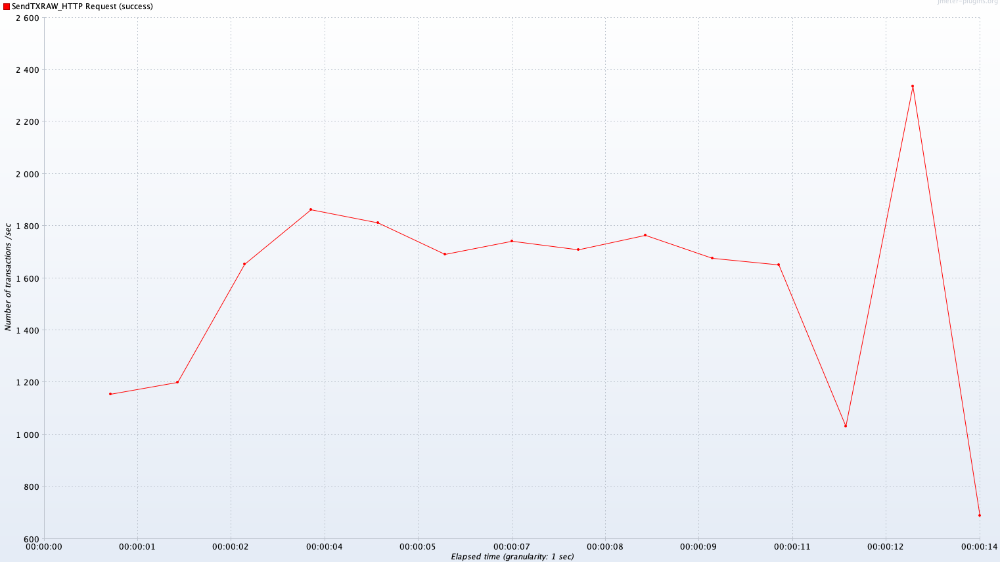
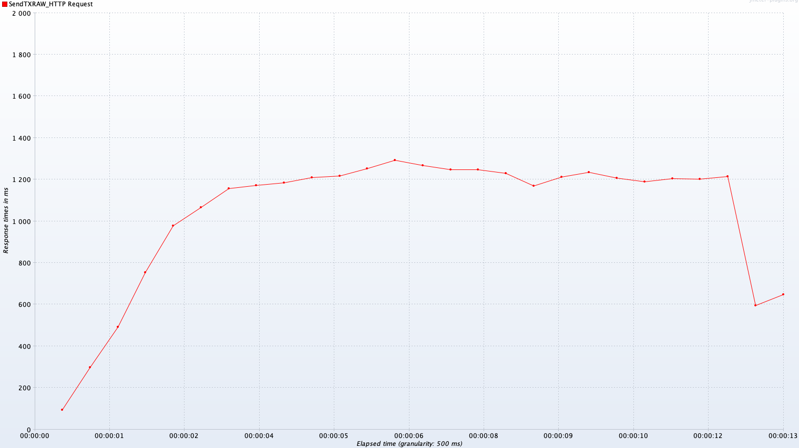

# <font color=Chocolate size=6>Stress Testing Report</font>

## Test Environment

#### Full Node
Total three full nodes.

Hardware Configurations of the nodes, which receiving the test transactions:
1. vCPU: 4
3. Memory: 2 GB
4. Disk: 25 GB

Software Configurations:
1. Operation System: Ubuntu, 18.04 LTS, Bionic
2. Golang Version: go1.12.7.  linux-amd64

Full node Configurations:
1. Memory Pool size: 1000 tx
2. Block Size: 1 MB
3. Block Reward: 25 token
4. Block Time: 5 second

#### Test Client
Hardware Configurations:
1. CPU: Intel(R) Core(TM) i7-8700K CPU@3.70GHz
2. Memory: 16 GB
3. Disk: Kingston SSD 256 GB
4. Network Bandwidth: 300 Mbps

Software Configurations:
1. Operation System: Windows 10
2. Jave Version: jdk-10.0.2
3. Stress Testing Software: Apache JMeter 5.1.1

#### Miner
1. CPU: Intel(R) Core(TM) i7-8700K CPU@3.70GHz
2. Memory: 16 GB
3. GPU: GeForce GTX 1060 5GB
4. Disk: Kingston SSD 256 GB

## Build Qitmeer-DAG Network
How to quickly run the Qitmeer-DAG Network, see [here.](https://github.com/HalalChain/qitmeer-docker-test/blob/master/README.md)

## Run miner
How to quickly run a miner, see [here.](https://github.com/HalalChain/qitmeer-docker-test/blob/master/miner_and%20mining_pool_manual.md)

## Test Step
- Configure the test environment
- Create accounts(addresses and private keys)
- Run Qitmeer-DAG nodes
- Configurate miner<br>
Configure the address of the sending transaction account to the mining address:<br> 
```asciidoc
./hlc-miner -s 47.93.20.102:1236 -u test -P 123 --symbol PMEER --notls -i 24 -W 256 --mineraddress TmN4SADy42FKmN8ARKieX9iHh9icptdgYNn --testnet
```
The following parameters can be modified depending on your situation:
    
    s :full node IP and port
    mineraddress: miner account address
    u : full node rpc username
    P : full node rpc password
- Mining to the send transaction account: 60 blocks, 1500 PMEER
- Create 43,956 signed RAW transactions through scripts and export them to CSV files

[Create sign raw transaction hash script](https://github.com/HalalChain/qitmeer-docker-test/blob/master/stress_testing_batch_create_transactions_script.md)
- Configure the test client(JMeter), Key configuration parameters:

      Number of Threads (users): 2200
      Ramp-Up Period (in seconds): 2
      Loop Count: 10

LoopController.loops=10, It is the number of transactions sent on behalf of a thread.
ThreadGroup.num_threads=2200, It is the number of threads opened.
The product of the two is the number of transactions sent this time.
- JMeter loads CSV files and sends RAW transactions to the test network 
by calling the sendRawTransaction RPC of the miner's full node. JMeter configures 2200 threads to send them, 
recording the start time of sending transactions.
- Look at the miner log, observe the packing block situation of the transaction, record the time when the first empty block appears,
 and when more than three empty blocks appear in a row, we can think that the transaction has been processed, 
 and take the first empty block time as the end time.
- View the total number of transactions through the logs of the miner
- TPS is calculated by dividing the total number of transactions by the test time.
TPS = Number of Successful Transactions /(Completion Time - Start Transaction Time)

## Transactions and Blocks log
There are two miner, the transactions and blocks logs of the miner one is:
```asciidoc

2019-10-07 12:25:42.205 [Debug] device #1 found hash:4bf582218bc7aaa2d109267205faa098acde8ea63038dde7fd900ebc6a8dbf42 nonce:5583341006592894532 target:7fffff0000000000000000000000000000000000000000000000000000000000
2019-10-07 12:25:42.48 [Info] 2019-10-07 12:25:42 PM,receive block, block height = 385,Including 999 transactions(not contain coinbase tx); Received Total transactions = 999

2019-10-07 12:25:46.504 [Debug] device #1 found hash:69566dd1a33a35398a4b5111e2aa67e3ff0b392a040d8e1af2c0f87e79df329c nonce:11054506708532004511 target:7fffff0000000000000000000000000000000000000000000000000000000000
2019-10-07 12:25:46.84 [Info] 2019-10-07 12:25:46 PM,receive block, block height = 386,Including 999 transactions(not contain coinbase tx); Received Total transactions = 1998

2019-10-07 12:25:50.708 [Debug] device #1 found hash:080bc118af9f5b8c7ab9022945f09dc2fc5e762f62f4af66deaf14561393a8be nonce:17402969378265038305 target:7fffff0000000000000000000000000000000000000000000000000000000000
2019-10-07 12:25:51.036 [Info] 2019-10-07 12:25:51 PM,receive block, block height = 387,Including 999 transactions(not contain coinbase tx); Received Total transactions = 2997

2019-10-07 12:25:54.593 [Debug] device #1 found hash:59563b6a723acfe49b4491d7df1f9e5092ea69f681da4435bdd8ceef6f3bb53d nonce:1962010929132342053 target:7fffff0000000000000000000000000000000000000000000000000000000000
2019-10-07 12:25:54.909 [Info] 2019-10-07 12:25:54 PM,receive block, block height = 388,Including 999 transactions(not contain coinbase tx); Received Total transactions = 3996

2019-10-07 12:25:58.557 [Debug] device #1 found hash:3712ab302e1830419589145efde1af1aa1802d3760cfde38d22ad534ba460319 nonce:15761214987325015694 target:7fffff0000000000000000000000000000000000000000000000000000000000
2019-10-07 12:25:58.881 [Info] 2019-10-07 12:25:58 PM,receive block, block height = 389,Including 999 transactions(not contain coinbase tx); Received Total transactions = 4995

2019-10-07 12:26:02.46 [Debug] device #1 found hash:4a561095c72a05a16b8378f72fba98ba2560f22d8c20875131ba11f2bd9dad6b nonce:9498340465875862869 target:7fffff0000000000000000000000000000000000000000000000000000000000
2019-10-07 12:26:02.78 [Info] 2019-10-07 12:26:02 PM,receive block, block height = 390,Including 999 transactions(not contain coinbase tx); Received Total transactions = 5994

2019-10-07 12:26:06.347 [Debug] device #1 found hash:6027f2c99a14dcf8cdf45675157fcfa3f294aa6aafc2bcd77f5dd2cdcdda1fca nonce:10031129990842035542 target:7fffff0000000000000000000000000000000000000000000000000000000000
2019-10-07 12:26:06.678 [Info] 2019-10-07 12:26:06 PM,receive block, block height = 391,Including 999 transactions(not contain coinbase tx); Received Total transactions = 6993

2019-10-07 12:26:10.387 [Debug] device #1 found hash:65dab3d43a23955e3450f987cb41eee132e97bbb20b69894451f93830d84298c nonce:4678197489918368290 target:7fffff0000000000000000000000000000000000000000000000000000000000
2019-10-07 12:26:10.736 [Info] 2019-10-07 12:26:10 PM,receive block, block height = 392,Including 999 transactions(not contain coinbase tx); Received Total transactions = 7992

2019-10-07 12:26:14.366 [Debug] device #1 found hash:01aecaf0224021e0247ec40b883318ef571b8146eef2b4b79be73ec576b0493f nonce:10974026504225358803 target:7fffff0000000000000000000000000000000000000000000000000000000000
2019-10-07 12:26:14.696 [Info] 2019-10-07 12:26:14 PM,receive block, block height = 393,Including 999 transactions(not contain coinbase tx); Received Total transactions = 8991

2019-10-07 12:26:18.222 [Debug] device #1 found hash:3a81d6626cd5236a0f38249894eea492268ff1934c763e6a7100af26309825fc nonce:9051830341466276783 target:7fffff0000000000000000000000000000000000000000000000000000000000
2019-10-07 12:26:18.559 [Info] 2019-10-07 12:26:18 PM,receive block, block height = 394,Including 999 transactions(not contain coinbase tx); Received Total transactions = 9990

2019-10-07 12:26:22.041 [Debug] device #1 found hash:46bf4a91f360fa2feb400954f1a367568068b553fd6d5c9592833fee76dc7342 nonce:17721947656816262213 target:7fffff0000000000000000000000000000000000000000000000000000000000
2019-10-07 12:26:22.406 [Info] 2019-10-07 12:26:22 PM,receive block, block height = 395,Including 999 transactions(not contain coinbase tx); Received Total transactions = 10989

2019-10-07 12:26:26.028 [Debug] device #1 found hash:37ef895a81933ed33356197a4afa9410ecb8f7eb21b740aaf7d31013ea3ec888 nonce:10911982865688981811 target:7fffff0000000000000000000000000000000000000000000000000000000000
2019-10-07 12:26:26.358 [Info] 2019-10-07 12:26:26 PM,receive block, block height = 396,Including 999 transactions(not contain coinbase tx); Received Total transactions = 11988

2019-10-07 12:26:29.963 [Debug] device #1 found hash:7f93fa141994837602b0619f4b84ddfa27fd7c324e7aaba7d607b587f2ecbf4f nonce:5750312677729068469 target:7fffff0000000000000000000000000000000000000000000000000000000000
2019-10-07 12:26:30.285 [Info] 2019-10-07 12:26:30 PM,receive block, block height = 397,Including 999 transactions(not contain coinbase tx); Received Total transactions = 12987

2019-10-07 12:26:34.102 [Debug] device #1 found hash:2d6d43a813dd04d16b32f43e2da169fa360753829b15028875593747f9b9a7b4 nonce:17923550921820271447 target:7fffff0000000000000000000000000000000000000000000000000000000000
2019-10-07 12:26:34.451 [Info] 2019-10-07 12:26:34 PM,receive block, block height = 398,Including 999 transactions(not contain coinbase tx); Received Total transactions = 13986

2019-10-07 12:26:37.909 [Debug] device #1 found hash:1f2428eaf1976427219312906cc9513ed1a182a011d0e2b916fd732ee566a296 nonce:3742499882996940456 target:7fffff0000000000000000000000000000000000000000000000000000000000
2019-10-07 12:26:38.244 [Info] 2019-10-07 12:26:38 PM,receive block, block height = 399,Including 999 transactions(not contain coinbase tx); Received Total transactions = 14985

2019-10-07 12:26:41.826 [Debug] device #1 found hash:7272f2ef2fa23cdc321d97b811b960938b02b004a7f924d482545efd587ab222 nonce:12008708676443231949 target:7fffff0000000000000000000000000000000000000000000000000000000000
2019-10-07 12:26:42.15 [Info] 2019-10-07 12:26:42 PM,receive block, block height = 400,Including 999 transactions(not contain coinbase tx); Received Total transactions = 15984

2019-10-07 12:26:45.646 [Debug] device #1 found hash:74ce9665a9daf96eb017ac37e3d6012f4613a7f8f6eadcefb3932a7fda20d62f nonce:2809105541966079374 target:7fffff0000000000000000000000000000000000000000000000000000000000
2019-10-07 12:26:45.96 [Info] 2019-10-07 12:26:45 PM,receive block, block height = 401,Including 999 transactions(not contain coinbase tx); Received Total transactions = 16983

2019-10-07 12:26:49.707 [Debug] device #1 found hash:243bb3c97e3649c6bc900904f5c41eba88aa9f5b5d31807ab44abde7a9e9bd09 nonce:10467684756724204366 target:7fffff0000000000000000000000000000000000000000000000000000000000
2019-10-07 12:26:50.034 [Info] 2019-10-07 12:26:50 PM,receive block, block height = 402,Including 999 transactions(not contain coinbase tx); Received Total transactions = 17982

2019-10-07 12:26:53.543 [Debug] device #1 found hash:22a545d4661f94e77d1b059abacdf81e6c674c31be8b8ff20a4b672f9957e3f5 nonce:3168841325311906696 target:7fffff0000000000000000000000000000000000000000000000000000000000
2019-10-07 12:26:53.861 [Info] 2019-10-07 12:26:53 PM,receive block, block height = 403,Including 999 transactions(not contain coinbase tx); Received Total transactions = 18981

2019-10-07 12:26:57.39 [Debug] device #1 found hash:01a4ef99e9b5294fd28670bfabfdbc0cc90f678df884dd172fa72101c6522cf7 nonce:6721539588344134730 target:7fffff0000000000000000000000000000000000000000000000000000000000
2019-10-07 12:26:57.711 [Info] 2019-10-07 12:26:57 PM,receive block, block height = 404,Including 999 transactions(not contain coinbase tx); Received Total transactions = 19980

2019-10-07 12:27:03.439 [Debug] device #1 found hash:738f3e6fca8c7028e010071533b60b7271c6a7acdc8ffadeae2b81c2feaa1e99 nonce:17103992997380202958 target:7fffff0000000000000000000000000000000000000000000000000000000000
2019-10-07 12:27:03.984 [Info] 2019-10-07 12:27:03 PM,receive block, block height = 406,Including 999 transactions(not contain coinbase tx); Received Total transactions = 20979

2019-10-07 12:27:07.138 [Debug] device #1 found hash:61486158626260f2ca5c1d5b68b0c48b4504dd00b6e7976c113a1170fc41a31c nonce:4419662115561923817 target:7fffff0000000000000000000000000000000000000000000000000000000000
2019-10-07 12:27:07.464 [Info] 2019-10-07 12:27:07 PM,receive block, block height = 407,Including 999 transactions(not contain coinbase tx); Received Total transactions = 21978

2019-10-07 12:27:09.831 [Debug] device #1 found hash:1f522a37931513db52d3cb606a4094ef53452970de8cd62f40abbae6bf187117 nonce:8089478282711575101 target:7fffff0000000000000000000000000000000000000000000000000000000000
2019-10-07 12:27:10.158 [Info] 2019-10-07 12:27:10 PM,receive block, block height = 408,Including 999 transactions(not contain coinbase tx); Received Total transactions = 22977

2019-10-07 12:27:13.217 [Debug] device #1 found hash:389ff3bbc9cfa84109365c8fe3b498564b720cc054f3102161446ff8340f7eff nonce:17305994588131310309 target:7fffff0000000000000000000000000000000000000000000000000000000000
2019-10-07 12:27:13.538 [Info] 2019-10-07 12:27:13 PM,receive block, block height = 409,Including 999 transactions(not contain coinbase tx); Received Total transactions = 23976

2019-10-07 12:27:19.33 [Debug] device #1 found hash:5557cb2f4665b46afdb652b41443f2238911d440d76a4da262c7d15fb4656d04 nonce:12962663046808695377 target:7fffff0000000000000000000000000000000000000000000000000000000000
2019-10-07 12:27:19.681 [Info] 2019-10-07 12:27:19 PM,receive block, block height = 411,Including 999 transactions(not contain coinbase tx); Received Total transactions = 24975

2019-10-07 12:27:25.042 [Debug] device #1 found hash:68add5b387aee96be4c5fb04ce6a65bfccc260fa3ecfc6222c6d9595a30f05db nonce:4374735798934435552 target:7fffff0000000000000000000000000000000000000000000000000000000000
2019-10-07 12:27:25.38 [Info] 2019-10-07 12:27:25 PM,receive block, block height = 413,Including 999 transactions(not contain coinbase tx); Received Total transactions = 25974

2019-10-07 12:27:27.566 [Debug] device #1 found hash:2a8b2455100c1221204e0439547a4b4d9aac1ace54d91c5a3f8a613d1799ff35 nonce:11673247920381276888 target:7fffff0000000000000000000000000000000000000000000000000000000000
2019-10-07 12:27:27.896 [Info] 2019-10-07 12:27:27 PM,receive block, block height = 414,Including 999 transactions(not contain coinbase tx); Received Total transactions = 26973

2019-10-07 12:27:30.931 [Debug] device #1 found hash:7042de4837bac3398c676a6b35af9250d89dc59f5fe8e97befd5561d1e976183 nonce:7197551179297757958 target:7fffff0000000000000000000000000000000000000000000000000000000000
2019-10-07 12:27:31.281 [Info] 2019-10-07 12:27:31 PM,receive block, block height = 415,Including 999 transactions(not contain coinbase tx); Received Total transactions = 27972

2019-10-07 12:27:33.33 [Debug] device #1 found hash:178b352ec9da6b5d5b1e2a643df115f7e9ebdd6a3a30d23f20f3680cd273cb0b nonce:7582247856139576252 target:7fffff0000000000000000000000000000000000000000000000000000000000
2019-10-07 12:27:33.667 [Info] 2019-10-07 12:27:33 PM,receive block, block height = 416,Including 999 transactions(not contain coinbase tx); Received Total transactions = 28971

2019-10-07 12:27:38.805 [Debug] device #1 found hash:1ff8e5a4a981146614710e710dbb77c1ff6942eb310d1fad8eb8913b9ac4573e nonce:2519093546530374129 target:7fffff0000000000000000000000000000000000000000000000000000000000
2019-10-07 12:27:39.148 [Info] 2019-10-07 12:27:39 PM,receive block, block height = 418,Including 999 transactions(not contain coinbase tx); Received Total transactions = 29970

2019-10-07 12:27:41.055 [Debug] device #1 found hash:00587ab4152dea06ab8d1e55d577f25f613574407de70183cd175a1d231b207c nonce:5980325434609311136 target:7fffff0000000000000000000000000000000000000000000000000000000000
2019-10-07 12:27:41.416 [Info] 2019-10-07 12:27:41 PM,receive block, block height = 419,Including 999 transactions(not contain coinbase tx); Received Total transactions = 30969

2019-10-07 12:27:43.143 [Debug] device #1 found hash:73923978508591e1aa126e1ed0d9e23e0f4180b2e0948234e320a4f6851a7403 nonce:1090193617238243789 target:7fffff0000000000000000000000000000000000000000000000000000000000
2019-10-07 12:27:43.461 [Info] 2019-10-07 12:27:43 PM,receive block, block height = 420,Including 999 transactions(not contain coinbase tx); Received Total transactions = 31968

2019-10-07 12:27:45.151 [Debug] device #1 found hash:3b3a60cb4aadf0c13958c3f4a8a69b1b62e0dabf0fc03e402bc9fff34e78dcad nonce:9182682406756748399 target:7fffff0000000000000000000000000000000000000000000000000000000000
2019-10-07 12:27:45.543 [Info] 2019-10-07 12:27:45 PM,receive block, block height = 421,Including 999 transactions(not contain coinbase tx); Received Total transactions = 32967

2019-10-07 12:27:48.905 [Debug] device #1 found hash:30feae5e7c892247ff9592b09c305aa9dfa2617d64db2a1360aabab818b6d486 nonce:2920943839548123653 target:7fffff0000000000000000000000000000000000000000000000000000000000
2019-10-07 12:27:49.243 [Info] 2019-10-07 12:27:49 PM,receive block, block height = 423,Including 999 transactions(not contain coinbase tx); Received Total transactions = 33966

2019-10-07 12:27:50.77 [Debug] device #1 found hash:40196fcceb595449aa47c13b1b6dccd838c765efada7f71269b799d2868be2bb nonce:3596334445258142947 target:7fffff0000000000000000000000000000000000000000000000000000000000
2019-10-07 12:27:51.103 [Info] 2019-10-07 12:27:51 PM,receive block, block height = 424,Including 999 transactions(not contain coinbase tx); Received Total transactions = 34965

2019-10-07 12:27:52.473 [Debug] device #1 found hash:5a7610769ca50bfc89eeff90efcc201792c93263314a6ee1dd8bea3c71200768 nonce:16842570140963063684 target:7fffff0000000000000000000000000000000000000000000000000000000000
2019-10-07 12:27:52.798 [Info] 2019-10-07 12:27:52 PM,receive block, block height = 425,Including 999 transactions(not contain coinbase tx); Received Total transactions = 35964

2019-10-07 12:27:54.344 [Debug] device #1 found hash:79978d3e5b8b51d739f85f2b462b6e0ba38a2e1d10a12d404b6749b2e535bb7b nonce:4208192556556139086 target:7fffff0000000000000000000000000000000000000000000000000000000000
2019-10-07 12:27:54.715 [Info] 2019-10-07 12:27:54 PM,receive block, block height = 426,Including 999 transactions(not contain coinbase tx); Received Total transactions = 36963

2019-10-07 12:27:56.379 [Debug] device #1 found hash:18974d6224b841f6e1076215e90a244c8f866df64e0f6228374990c8c58f280f nonce:1059910573940541950 target:7fffff0000000000000000000000000000000000000000000000000000000000
2019-10-07 12:27:56.738 [Info] 2019-10-07 12:27:56 PM,receive block, block height = 427,Including 999 transactions(not contain coinbase tx); Received Total transactions = 37962

2019-10-07 12:27:57.937 [Debug] device #1 found hash:07845357e0ad16372fe142ff9b0cc66bec58220fda949cd308ea0a953acc961a nonce:3210759742860309373 target:7fffff0000000000000000000000000000000000000000000000000000000000
2019-10-07 12:27:58.29 [Info] 2019-10-07 12:27:58 PM,receive block, block height = 428,Including 998 transactions(not contain coinbase tx); Received Total transactions = 38960

2019-10-07 12:27:59.253 [Debug] device #1 found hash:55008b517e7f5e0e809195d168ccc203ea9955b6051376285778664fba2d6037 nonce:5429863790445883500 target:7fffff0000000000000000000000000000000000000000000000000000000000
2019-10-07 12:27:59.255 [Info] 2019-10-07 12:27:59 PM,receive block, block height = 429,Including 0 transactions(not contain coinbase tx); Received Total transactions = 38960
```
The transactions and blocks logs of the miner two is:
```asciidoc
2019-10-07 12:27:00.327 [Debug] device #1 found hash:3eb2d3cbe73bf99b482007c139af11b2fa4be6e2dd75dfc6bad6d8e9471e8cba nonce:12548410747917992860 target:7fffff0000000000000000000000000000000000000000000000000000000000
2019-10-07 12:27:00.637 [Info] 2019-10-07 12:27:00 PM,receive block, block height = 405,Including 999 transactions(not contain coinbase tx); Received Total transactions = 999

2019-10-07 12:27:15.805 [Debug] device #1 found hash:502e8bdbd6f50dc6c8a377ef730e5a53cd5ce7b7db31a52387776b48faa0bf08 nonce:3627388864363862378 target:7fffff0000000000000000000000000000000000000000000000000000000000
2019-10-07 12:27:16.134 [Info] 2019-10-07 12:27:16 PM,receive block, block height = 410,Including 999 transactions(not contain coinbase tx); Received Total transactions = 1998

2019-10-07 12:27:21.922 [Debug] device #1 found hash:3c3496440dee2a848e99846a9091a1674771296a826c798a496e5e694e30f319 nonce:18184903437055173947 target:7fffff0000000000000000000000000000000000000000000000000000000000
2019-10-07 12:27:22.296 [Info] 2019-10-07 12:27:22 PM,receive block, block height = 412,Including 999 transactions(not contain coinbase tx); Received Total transactions = 2997

2019-10-07 12:27:35.645 [Debug] device #1 found hash:33431fac567a39904fcc2c39c706e290d2afa9d8e6f59dcdcea7746ec2d0ca2f nonce:11801704621670749687 target:7fffff0000000000000000000000000000000000000000000000000000000000
2019-10-07 12:27:35.976 [Info] 2019-10-07 12:27:35 PM,receive block, block height = 417,Including 999 transactions(not contain coinbase tx); Received Total transactions = 3996

2019-10-07 12:27:46.999 [Debug] device #1 found hash:19bec64a22e314fb873d0011cb2d23b6dfe598eea4f9fffdd8f9d16891f80a56 nonce:2926421854567845410 target:7fffff0000000000000000000000000000000000000000000000000000000000
2019-10-07 12:27:47.359 [Info] 2019-10-07 12:27:47 PM,receive block, block height = 422,Including 999 transactions(not contain coinbase tx); Received Total transactions = 4995

2019-10-07 12:27:59.496 [Debug] device #1 found hash:7ccb8cc89d2f34cdb534e5449e26aa58c099e6d008b7ba11484c678184898b3f nonce:358544773880416554 target:7fffff0000000000000000000000000000000000000000000000000000000000
2019-10-07 12:27:59.499 [Info] 2019-10-07 12:27:59 PM,receive block, block height = 430,Including 0 transactions(not contain coinbase tx); Received Total transactions = 4995
```

It can be seen that a total of 43955 transactions have been sent, which takes 00:02:15, 
which is 135 seconds, and the transaction transmission speed is 326 transactions/s.

## Test result
Number of transactions/sec:


Response time in ms:


CPU and Memory of Full node(miner connected) :


According to the steps described above, three tests, taking the average of three results, 
the final results are as follows:

num of TXs | send rate | success % | num of blocks | duration | TPS 
------------ | ------------- | ------------- | ------------- | ------------- | -------------
43,956 | 662.2/s  | 99.998% | 44 | 135s | 326

## Conclusion
During the test, different transmission rates were used and different transaction volumes were tested. 
The test results TPS reached more than 326.

TPS is very related to the following two configurations: 
1) The maximum number of transactions in a block (block sizes)
2) The average block time


