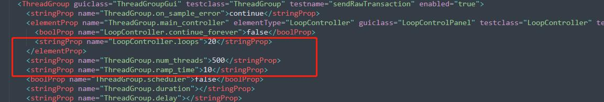
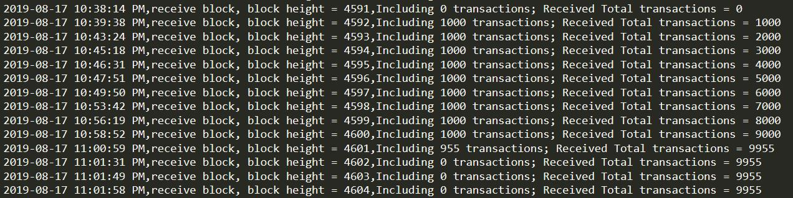
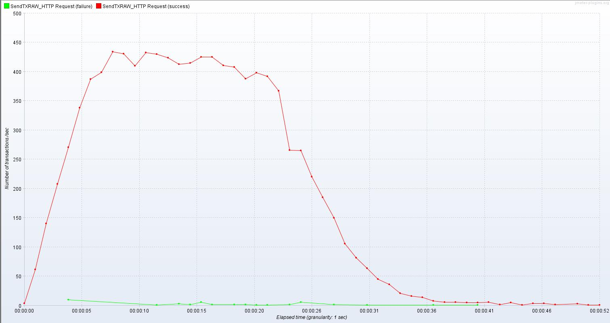
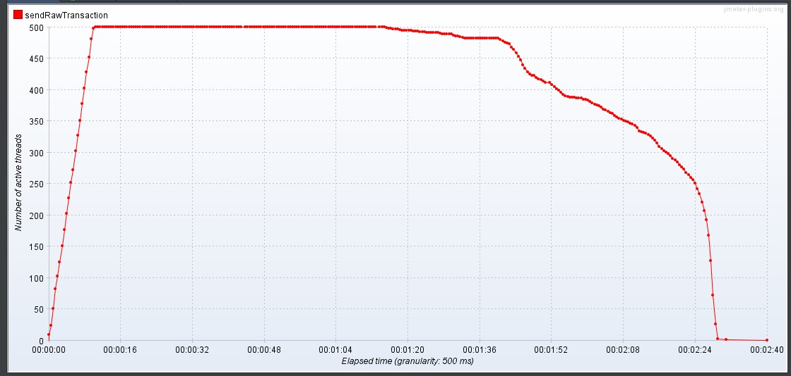
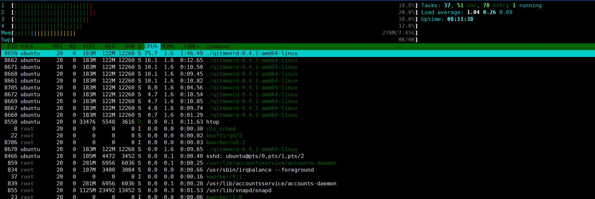
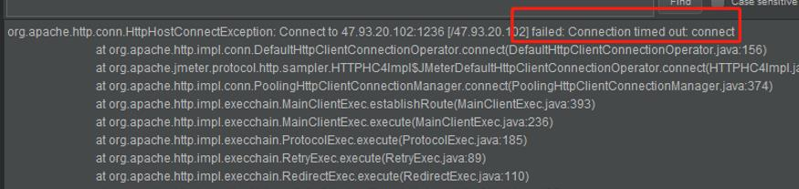

# <font color=Chocolate size=6>Stress Testing Report</font>

## Test Environment

#### Full Node
Each node is an Aliyun VPS, total six full nodes.

Hardware Configurations:
1. CPU: Intel Xeon E5-2682v4, 2.50 GHz, 1 core
2. Memory: 2 GB
3. Disk: Ultra Disk 40 GB

Software Configurations:
1. Operation System: ubuntu 16.04.4 LTS
2. Golang Version: go1.12.5.  linux-amd64

Full node Configurations:
1. Memory Pool size: 1000 tx
2. Block Size: 4 MB
3. Block Reward: 25 token
4. Block Time: 2 minute

#### Test Client
Hardware Configurations:
1. CPU: Intel® Core™ i7-8550U CPU @ 1.80GHz 2.00GHz
2. Memory: 8 GB
3. Disk: LITEON CV3-8D128
4. Network Bandwidth: 100 Mbps

Software Configurations:
1. Operation System: Windows 10
2. Jave Version: jdk-10.0.2
3. Stress Testing Software: Apache JMeter 5.1.1

#### Miner
1. CPU:Intel® Core™ G1840 CPU @ 2.8GHz 2 core
2. Memory: 4G
3. GPU: Sapphire RX580 8G
4. Disk: Turxun 120 SSD

## Build Qitmeer-DAG Network
How to quickly run the Qitmeer-DAG Network, see [here.](https://github.com/HalalChain/Nox-DAG-test/blob/master/README.md)

## Run miner
How to quickly run a miner, see [here.](https://github.com/HalalChain/hlc-miner/blob/master/README.md)

## Test Step
- Configure the test environment
- Create accounts(addresses and private keys)
- Run Qitmeer-DAG nodes
- Configurate miner<br>
Configure the address of the sending transaction account to the mining address:<br> 
```asciidoc
./hlc-miner -s 47.93.20.102:1236 -u admin -P 123 --symbol HLC --notls -i 24 -W 256 --mineraddress TmN4SADy42FKmN8ARKieX9iHh9icptdgYNn --testnet
```
The following parameters can be modified depending on your situation:
    
    s :full node IP and port
    mineraddress: miner account address
    u : full node rpc username
    P : full node rpc password
- Mining to the send transaction account: 120 blocks, 3000 HLC
- Create 30,000 signed RAW transactions through scripts and export them to CSV files

[Create sign raw transaction hash script](https://github.com/HalalChain/Nox-DAG-test/blob/master/stress_testing_batch_create_transactions_script.md)
- Configure the test client(JMeter), Key configuration parameters:

      Number of Threads (users): 500
      Ramp-Up Period (in seconds): 10
      Loop Count: 20

LoopController.loops=20, It is the number of transactions sent on behalf of a thread.
ThreadGroup.num_threads=500, It is the number of threads opened.
The product of the two is the number of transactions sent this time.
- JMeter loads CSV files and sends RAW transactions to the test network 
by calling the sendRawTransaction RPC of the miner's full node. JMeter configures 500 threads to send them, 
recording the start time of sending transactions.
- Look at the miner log, observe the packing block situation of the transaction, record the time when the first empty block appears,
 and when more than three empty blocks appear in a row, we can think that the transaction has been processed, 
 and take the first empty block time as the end time.
- View the total number of transactions through the logs of the miner
- TPS is calculated by dividing the total number of transactions by the test time.
TPS = Number of Successful Transactions /(Completion Time - Start Transaction Time)

## Transactions and Blocks log

It can be seen that a total of 5995 transactions have been sent, which takes 00:21:14, 
which is 1274 seconds, and the transaction transmission speed is 4.7 transactions/s.

## Test result
Number of transactions/sec:


Number of active Threads:


CPU and Memory of Full node(miner connected) :


According to the steps described above, three tests, taking the average of three results, 
the final results are as follows:

num of TXs | send rate | success % | num of blocks | duration | TPS 
------------ | ------------- | ------------- | ------------- | ------------- | -------------
6,000 | 500/s  | 99.91% | 7 | 1199s | 5

## Conclusion
During the test, different transmission rates were used and different transaction volumes were tested. 
The test results TPS reached more than 5.

some issue：
- connection timed out error:

This error occurs when the request timed out due to server-side CPU 100% .

- references bad output:
```
2019-05-16|19:47:12.677 [TRACE] Skipping tx %s because it references bad output %s which is not available LOG15_ERROR=
2019-05-16|19:47:12.680 [TRACE] Skipping tx %s because it references bad output %s which is not available LOG15_ERROR=
2019-05-16|19:47:12.683 [TRACE] Skipping tx %s because it references bad output %s which is not available LOG15_ERROR=
2019-05-16|19:47:12.684 [TRACE] Skipping tx %s because it references bad output %s which is not available LOG15_ERROR=
2019-05-16|19:47:12.685 [TRACE] Skipping tx %s because it references bad output %s which is not available LOG15_ERROR=
```


 
 


